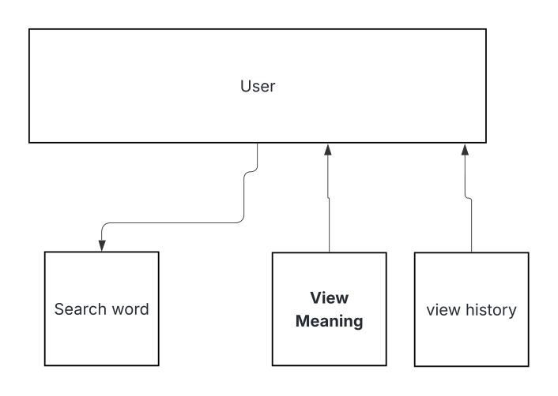
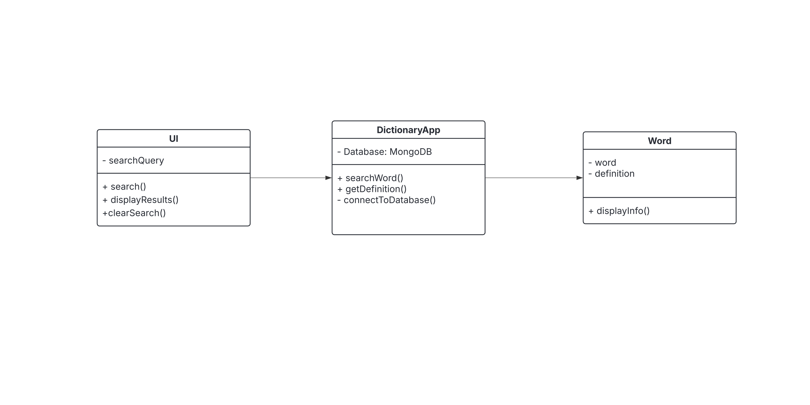

# CIS-350-Group-Project

## Made By
Miles Bartram

Hugo Porras

## Indroduction
Our project is going to be making a dictionary app. This app will allow the user to input a word and the app will output the definition for that word.

## Architectural Design
Our project is mainly programmed in python but the dictionary itself is pullled through an api. This way we do not have to make a whole new piece of code for the dictionary itself. 
  
  ### Use case Diagram
  

  ### Class Diagram

## User Guide
Once the user downloads the app, the user will simply see a search bar with a prompt to tell the user to put in a word. 

The User would then put in a word in the search bar and then the screen would then add a bar with text in it saying the definition of the word.

Then there would be a prompt saying if the user would like to search for another word and the user can say yes or no. If the user says yes, the search line will be empty again. If the user selects no. The prompt will stop. 

  ### Risk Analysis and Retrospective 
There are a lot of risks with the app. I would say the biggest risk could be that the app could crash from the yes or no prompt especially for the no option as it can have the same function as the yes prompt making it a little useless. The usage of an api could also add to some risks given the fact that the user would have to be online then to use the app. Another risk to using an api is that the developers have to rely on an external source to make sure the definitions are correct. In retrospect the biggest problems with the development in the project were scheduling conflicts and spending too much time on things that were not related to the software itself. We should have definitalty started earlier and have planned out what each person needed to do and overall communicate more frequently. This is mainly the cause of why the software does not really work. 

[Our Jira Page](https://mbartram.atlassian.net/jira/software/projects/SCRUM/boards/1)
